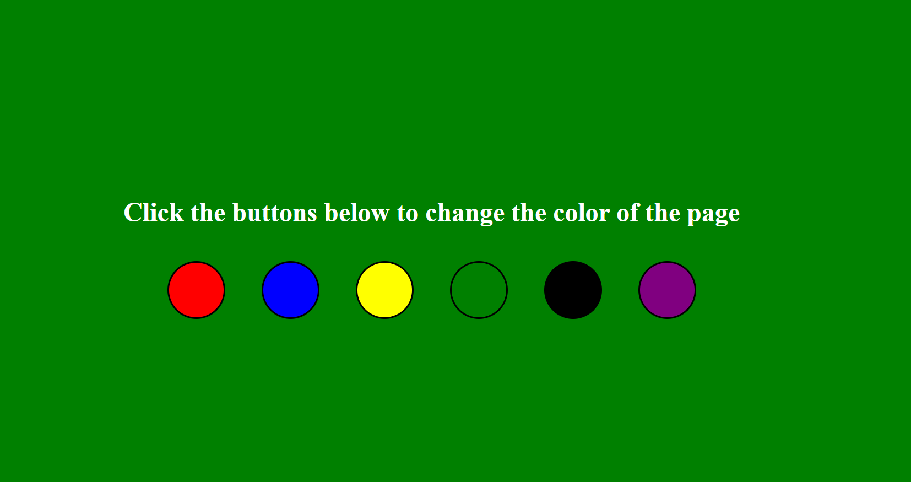

<link rel ="stylesheet" href="style2.css">
  <div class = "heading">
    <h1>Color Switcher</h1>
  </div>
  <nav class = "topbar">
    <button onclick="window.location.href='index.html';">About</button>
    <div class="dropdown">
      <button class = "dropbtn">Portfolio</button>
        <div class="dropdown-content">
          <a href="Python.html">Python</a>
          <a href="Javascript.html">Javascript</a>
        </div>
    </div>
    <button onclick="window.open('https://www.youtube.com/@shellysachdev/videos', '_blank')">YouTube</button>
  </nav>

  My Year 12 students worked on creating this very simple Javascript app to practice using the document manipulation methods and capturing the id of the button which targeted an event on the page. 

  The page that we designed looked like the one below:

  <center></center>

  The motivation to pursue a skill comes from accomplishment and hence to motivate my students to learn web based technologies like HTML,CSS and Javascript, the idea was to give them simple challenges like these which they could accomplish within one lesson and feel like they have achieved something. This project was to set a base for their learning in future. 

  Let us jump into the code part of this app:

## HTML Code

  ```{HTML}
    <!DOCTYPE html>
    <html lang="en">
    <head>
      <meta charset="UTF-8">
      <meta http-equiv="X-UA-Compatible" content="IE=edge">
      <meta name="viewport" content="width=device-width, initial-scale=1.0">
      <title>Document</title>
      <link rel="stylesheet" href="style.css">
      
    </head>
    <body>
      <div>
        <h1>Click the buttons below to change the color of the page</h1>
      </div>
      <div>
        <button class = "btns" id="red"></button>
        <button class = "btns" id="blue"></button>
        <button class = "btns" id="yellow"></button>
        <button class = "btns" id="green"></button>
        <button class = "btns" id="black"></button>
        <button class = "btns" id="purple"></button>
      </div>
      <script src = "script.js"></script>
    </body>
    </html>
```

The HTML code above is fairly easy to understand. The top part enclosed between the **head tags** is simply the boilerplate code which makes sure our code would be rendered as a webpage and to make sure we have linked our .html file with a stylesheet(.css) and a Javascript(.js) file.

If you see in the above code, we have created two divisions. The *first division* inside the *body* of the page is to house the main heading of our webpage which in this case is **Click the buttons below to change the color of the page**. The second division is to hold our six buttons which are all attached to the same class name **btns** because we want them all to have the same style and look and feel. However, each of these buttons will perform a different action i.e to change the color of the page as dictated by their own color so to give them each a unique identity, we assigned them a unique id which in this case is the name of the color. 

## CSS Code

The first thing that we want our stylesheet to do is to align the heading and the buttons in the center. Also, the heading must be on top of the buttons and the buttons are aligned in a row side by side. 

The best way to achieve this kind of a layout is to use CSS Flex layout. You can read about various flex properties [here](https://css-tricks.com/snippets/css/a-guide-to-flexbox/).

The CSS code for the body of the page is below. I will explain each property in detail.

```{CSS}
  body 
  {
    display: flex;
    flex-direction: column;
    justify-content: center;
    align-items: center;
    height: 100vh;
    background-color: rgb(236, 28, 184);
    color: white;
  }
```

1. **display: flex** = This property is to set the entire page as a flex layout.
2. **flex-direction**: column = We want the heading and then buttons below the heading so we have set the flex-direction to column so that both our divisions are in a column format.
3. **justify-content**: center = This will align the heading and the buttons in the center of the main axis. The main axis in this case is vertical because we chose **column** as the flex-direction.
4. **align-items**: center = This works in the same way as justify-content but on the cross-axis. This property will align items in center on the horizontal axis. 
5. **height: 100vh** = The height of our webpage has been set as 100vh. **vh** here stands for **viewport height** which means the entire screen that is visible to us. 
6. **background-color** = Initial color of the background when the page opens.
7. **color: white** = This is the text color of the heading which will remain white throughout. 

Next, let us work on styling the buttons. Each button is of same size and is round in shape so let us add the CSS properties to the **.btns** class as that will apply to all the buttons. 

```{CSS}
  .btns {
  height: 70px;
  width: 70px;
  margin: 20px;
  border-radius: 50%;
  }
```

The above code is self-explanatory. All buttons have a height and a width of 70 pixels each. They are separated by a margin of 20 pixels and the border-radius has been set as 50% because we wanted a round shape. 

The last bit left is to give each button a different color. We cannot do that by adding any of those colors to the **.btns** class because each of these buttons need to have a different color. Hence, the below code needs to be added to your CSS file. 

```{CSS}
  #red {
  background-color: red;
  }

  #green{
    background-color: green;
  }

  #yellow{
    background-color: yellow;
  }

  #blue{
    background-color: blue;
  }

  #black{
    background-color: black;
  }

  #purple{
    background-color: purple;
  }
```

## Javascript Code

HTML and CSS is like giving the webpage a physical body while Javascript adds life and soul to your webpage. 

Let us now play with some Javascript code to add life to our buttons. 

The first part of the code is to get all the necessary elements pulled into our JS code. We want the buttons as well as the body of the webpage because the background color of the page needs to be manipulated by the button presses.

Let us first get all the six buttons as an array into our code:

```{Javascript}
  const buttons = document.querySelectorAll(".btns");
```

Let us now get the **body** element too:

```{Javascript}
  const body = document.querySelector('body');
```

You must be wondering why have we used different methods for getting the buttons and the body. For the buttons, we used **document.querySelectorAll** and for the body element, we used **document.querySelector**. The first one is able to get a list of elements associated with the same class while the latter is used to get one single element in JS code. 

Now that we have the required elements in our JS code, let us add an event listener on each of our six buttons so that we know which one targeted an event on our page. We don't have to add an event listener individually to each button. Instead, we can use a FOR loop which will iterate over each of the six buttons and will tell us which of these buttons was pressed. 

Whichever button was pressed, we will get its id and will place it into a variable. If you remember from the HTML code, we kept the ids of the buttons as their color names. Hence, if the button with id=red was pressed, we will place **red** into a variable and we will use the variable's value to change the background color of the body. 

```{Javascript}

  for (i of buttons){
    i.addEventListener("click", function(e){
      var color_picked = e.target.id;
      body.style.backgroundColor = color_picked;
      
  })
  }
```

The code for this activity can be found [here](https://github.com/Shelly1986/colorswitcher.git)


