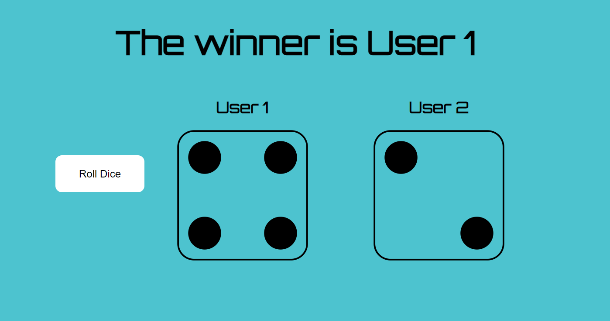

<link rel ="stylesheet" href="style2.css">
  <div class = "heading">
    <h1>Dice Roll</h1>
  </div>
  <nav class = "topbar">
    <button onclick="window.location.href='index.html';">About</button>
    <div class="dropdown">
      <button class = "dropbtn">Portfolio</button>
        <div class="dropdown-content">
          <a href="Python.html">Python</a>
          <a href="Javascript.html">Javascript</a>
        </div>
    </div>
    <button onclick="window.open('https://www.youtube.com/@shellysachdev/videos', '_blank')">YouTube</button>
  </nav>

As an endeavour to learn some Javascript in the most fun way possible, we took up this tiny little project of simulating a two player dice roll game. 

The final web page looked like the one below:

<center></center>

It is a simple web page with a **Roll Dice** button. When we press the button, player 1 and player 2's dice inputs are chosen randomly and depending upon the value on the dice, the winner is displayed.

First and foremost, look for six dice pictures from the web and download them in your project folder. Try to look for similar style images with a transparent background. One important part is to save the images as **1.png** , **2.png** and so on until **6.png**. We are doing this consciously because we want our code to randomly choose numbers in the range 1 to 6 and the corresponding image will be placed in the right place for each player on our web page.  

Our dice images folder must look like the one below:

<center></center>


## HTML Code 

The top part of the code will remain the same *boilerplate* code where we simply link the stylesheet and the javascript files.

```{HTML}
  <!DOCTYPE html>
  <html lang="en">
  <head>
    <meta charset="UTF-8">
    <meta http-equiv="X-UA-Compatible" content="IE=edge">
    <meta name="viewport" content="width=device-width, initial-scale=1.0">
    <title>Dice Game</title>
    <link rel="stylesheet" href="style.css">
  </head>
```

Inside the body of the webpage, we need a top main heading, two empty spaces for the two dices and a button to roll the dice. 

```{HTML}
  <body>
    <h1>Two Player Dice Game</h1>
    <div class = "main">
      <button class = "button" onclick = "rolldice()">Roll Dice</button>
      <div class = "dice-roll">
        <h2>User 1</h2>
        
      </div>

       <div class = "dice-roll">
        <h2>User 2</h2>
        
      </div>
    </div>
    <script src = "script.js"></script>
  </body>
  </html>
```

As you can see above, we have one main division with class as **main** and inside this main division, we have two other divisions with the class as **dice-roll**. These two divisions are for each of the two players' dice choices. We have consciously used an empty **image tag** inside these two divisions because when the game starts, we want two empty spaces to appear which will eventually hold the dice images for the two players. These images will be updated through the Javascript code when the **Roll Dice** button is pressed. 

## CSS Code

For the body of the webpage, we only wanted a simply solid color background and a specific font-style:

```{CSS}
  body 
  {
    background: rgb(77,195,207);
    font-family: Orbitron;
  }
```

For the main heading on top too, we simply wanted the heading to appear in the center of the webpage and a bigger font-size.

```{CSS}
  h1
  {
    text-align: center;
    font-size: 50px;
  }
```

As explained above, we have a **main division** which will hold the dice images and the button and we want them all to be horizontally aligned and so we need to use the **flex** display for the main division.

```{CSS}
  .main {
    display: flex;
    justify-content: center;
    align-items: center;
  }
```

To space out the player1 and player2's choices by a margin, we can use an inline margin of 50 px.

```{CSS}
  .main div{
    margin-inline: 50px;

  }
```

The two dice images need to be of the same width and height for an aesthetic look. So, we can set the width and height on the img tag but we need to use the name of the class since they are a part of a division **dice-roll**

```{CSS}
  .dice-roll img {
  width: 200px;
  height: 200px;
  }
```

Now comes the styling of the button. You can use whatever styling you want for your button. We have used the below properties on the button:

```{CSS}
  .button {
    background-color: white;
    border: solid 4px white;
    color: black;
    padding: 15px 32px;
    text-align: center;
    text-decoration: none;
    display: inline-block;
    font-size: 16px;
    align-items: center;
    border-radius: 10px;
  }
```

We have also used a little more styling on the button when we hover our mouse on it or when the button is active. All properties used below on the button are self-explanatory.

```{CSS}
  .button:hover {
    background-color: #132488;
    color: white;
  }

  .button:active {
    background-color: #eef3ee;
    color: blue;
    transform: translateY(4px);
  }
```

## Javascript Code

In our HTML code, when we created the button, we had used the following line of code:

```{HTML}
  <button class = "button" onclick = "rolldice()">Roll Dice</button>
```

We had used the onclick property of the button to simply say that when the button is clicked, a **function rolldice()** will work in the Javascript code. 

Let us now define the **rolldice()** function in Javascript.

The first action that we want our button to perform is to pick up two random images from the dice images that we had downloaded off the web. 

```{Javascript}
  function rolldice(){
    const firstNumber = Math.floor(Math.random()*6)+1
		const image1 = 'dicepics/' + firstNumber + '.png'
		const secondNumber = Math.floor(Math.random()*6)+1
		const image2 = 'dicepics/' + secondNumber + '.png'
```

The line of code **const firstNumber = Math.floor(Math.random()*6)+1** chooses a random number in the range of 1 to 6. 
The function **Math.random()*6** chooses a random number between 0 to 5 but since this number could be a decimal number so we need to use **Math.floor** to round the number. We also need to add a 1 to the result because in case Math.random chooses 0.4 then Math.floor would round it off to 0 and we need numbers between 1 to 6 and so we need to add 1 to the result. 

The second line of code **const image1 = 'dicepics/' + firstNumber + '.png'** inside our rolldice() function simply attaches the first chosen random number with *.png* and picks up the corresponding image from our *dicepics* folder and places it inside a constant **image1**.

The above procedure is repeated for the second image too and so we get image1 and image2 as two random dice images chosen by our code. 

If you remember from our HTML code, we had kept two blank img tags inside each of the two divisins where our random images would be placed. Now that we have image1 and image2 as two random dice images chosen by our program, let us now place them onto our web page. 

```{Javascript}
  document.querySelectorAll('img')[0].setAttribute('src',image1)
	document.querySelectorAll('img')[1].setAttribute('src',image2)
```

We have used ('img)[0] and ('img')[1] to refer to the first and the second image placeholder on our webpage. 

The last part of the code is pretty simple. We only need to compare the two two random numbers and see which one is bigger so as to display the correct winner out of the two players. Our top heading which said **Two Player Dice Game** would be replaced by **User1 wins** or **User2 wins** or **It's a draw**. 

```{Javascript}
  if (firstNumber > secondNumber) {
		document.querySelector('h1').innerHTML = "The winner is User 1";
	} else if (secondNumber > firstNumber) {
		document.querySelector('h1').innerHTML = "The winner is User 2"
	} else {
		document.querySelector('h1').innerHTML = "It's a draw"
	}
```
As an extension task, you can try to add 10 rolls in one round and declare an overall winner for each round. 

[The entire code can be found here.](https://github.com/Shelly1986/diceroll.git)


