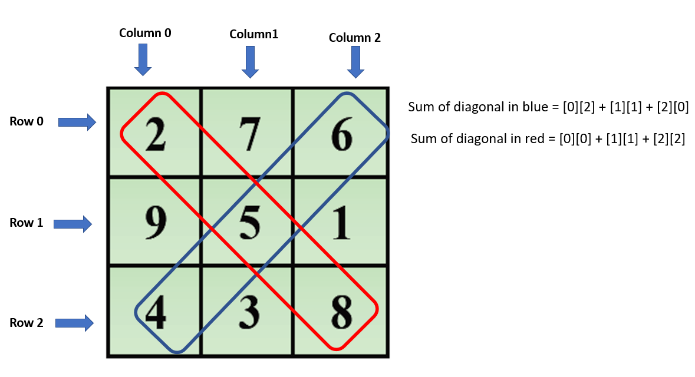

<link rel ="stylesheet" href="style2.css">
  <div class = "heading">
    <h1>Magic Square</h1>
  </div>
  <nav class = "topbar">
    <button onclick="window.location.href='index.html';">About</button>
    <div class="dropdown">
      <button class = "dropbtn">Portfolio</button>
        <div class="dropdown-content">
          <a href="Python.html">Python</a>
          <a href="Javascript.html">Javascript</a>
        </div>
    </div>
    <button onclick="window.open('https://www.youtube.com/@shellysachdev/videos', '_blank')">YouTube</button>
  </nav>
  <br>

  A **magic square** is a square matrix of numbers. In computing terms, it is a 2-dimensional array of positive integers. 
  
  But why is it called a magic square? 
  
  Well, the fact that the sum of numbers in each **horizontal row**, each **vertical column** and each **diagonal** is the same, that is the magical element.

  As an expectation in the Year 11 curriculum, students had to learn the concept of 2D arrays. To make the topic fun as well as challenging, we decided to understand it using Python so that everytime we input a 2D square matrix, Python tells us instantly if the input array meets the requirements to be crowned as a magic square or not.

  Let us look at the code:

  First of all, we need to initialise an **empty list** in Python to hold our 2D array:

  ```{Python}
  magic_square = []
  ```

  Next, row by row, we need to append the numbers into our empty list.

  ```{Python}
  magic_square.append([2,7,6])
  magic_square.append([9,5,1])
  magic_square.append([4,3,8])
  ```

  We also need another **variable 'n'** which is basically the length of the array. We need this later when we would iterate through the magic square.

  ```{Python}
  n = len(magic_square)
  ```

  In the final output of this program, we want to display the 2D array as well as a verdict on whether it is a magic square or not. Hence, first let us write a display function which when called, would just print the 2D array on screen.

  ```{Python}
  def display():
    for row in magic_square:
        print(row)
  ```

  Now is when we should start writing another function in our code which will take this 2D matrix and will tell us whether it is a magic square or not. 

  The logic that we will use in our program is as follows:
  1. Calculate the sum of numbers on each of the two diagonals.
  2. Compare if these sums are equal or not.
  3. Calculate the sum of numbers on each row and each column and compare the sums to the diagonal sums to see if they match.
   
  Let us apply this logic in coding now:

  First we will calculate the sum of the numbers on both the diagonals and compare the sum to see if they are equal.
  
  Visually, the below picture describes what we should be writing into our code. 

  

  Let us first write the code for the red diagonal. We basically have to add elements on [Row 0][Column 0], 
  [Row 1][Column 1], [Row 2][Column 2]. 

  ```{Python}
  def check(): #check() is the name of the function
    sum_d1 = 0 #variable to initialise sum of diagonal1 to 0
    sum_d2 = 0 #variable to initialise sum of diagonal2 to 0
    for row in range(3):
        sum_d1 += magic_square[row][row]
  ```

  In the above code, the value of 'row' starts from 0 and so the first number that gets added to the sum is [0][0]. As the value of 'row' gets incremented to 1, the next element that gets added to the sum is [1][1] and finally the element [2][2] gets added to the sum. This is when the loop finishes its three full iterations. 

  Next, let us look at the code for summing up the elements in the blue diagonal. 

  In the blue diagonal, we need to add the elements on [0][2],
  [1][1] and [2][0]. In this case, the value of 'row' is increasing from 0 to 2 and the value of column is decreasing from 2 to 0.

  ```{Python}
  for i in range(3):
        sum_d2 += magic_square[i][n-i-1]
  ```

  The above code beautifully calculates the sum of numbers on the blue diagonal as the value of 'i' goes from 0 to 2 which is the 'row' and column is set as [n-i-1]. 'n' is the length of the array which is 3 and so in the first iteration of the loop, [n-i-1] will be 2. So, the first time the loop runs, the first element that gets added to the sum of the blue diagonal would be [0][2] which is exactly what we wanted. In the next iteration of the loop, 'i' becomes 1 and so we add the element [i][n-i-1] which is [1][1] and so on for the last element. 

  Now let us check if the sum of the numbers on the red diagonal is equal to the sum of the numbers on the blue diagonal.

  ```{Python}
  if not(sum_d1 == sum_d2):
    return "Not a magic square"
  ```

  Congratulations, we have successfully checked off the first condition of the magic square. 
  
  Next we need to check if the sum of the numbers on each row is equal to the sum of the numbers on each column. In this case, we will have to use the **nested FOR loops** because we will start with Row 0 and add all the three numbers on this row. Next, we will increment to Row 1 and do the same and finally finish it off with Row 2 which is the last row. As you would have noticed, for each iteration of the row, we are moving from column 0 to 2. So, the outer FOR loop must iterate on rows and the inner FOR loop must iterate on columns. 

  ```{Python}
  for row in range(0,3):
    sum_rows = 0
    sum_columns = 0
    for col in range(0,3):
      sum_rows += magic_square[row][col]
      sum_columns += magic_square[col][row]
  ```

  Let us now check whether the sum of rows is equal to the sum of columns and whether it also equals the sum of any of the above diagonal sums. 

  ```{Python}
  if not(sum_rows == sum_columns == sum_d1):
    return "Not a magic square"
  ```

  The last line in the check() function is:
  
  ```{Python}
  return "It is a magic square"
  ```

  If the checks that we executed in point no. 1 and 2 above fail, then our grid is certainly a magic square. 

  Lastly, outside the check() function, we must call the display() function so that our grid gets printed on screen and also we must print the value being returned from our check() function.
  
  ```{Python}
  display()
  print(check())
  ```

  [The entire code can be found here](https://github.com/Shelly1986/magicsquare.git)


