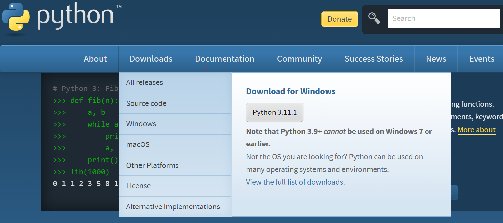
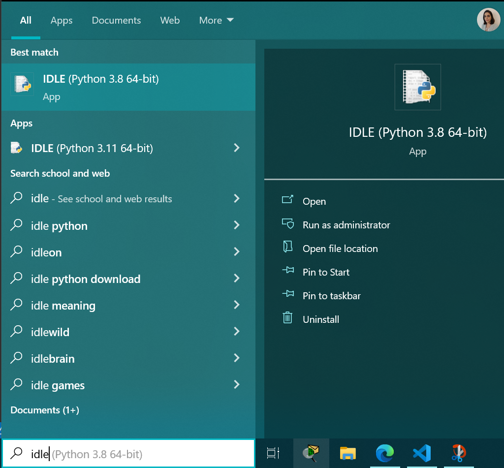
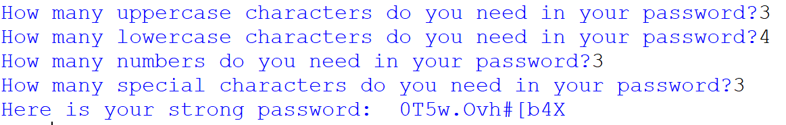

  
  <link rel ="stylesheet" href="style2.css">
  <div class = "heading">
    <h1>Let Python help you generate a strong password</h1>
  </div>
  <nav class = "topbar">
    <button onclick="window.location.href='index.html';">About</button>
    <div class="dropdown">
      <button class = "dropbtn">Portfolio</button>
        <div class="dropdown-content">
          <a href="Python.html">Python</a>
          <a href="Javascript.html">Javascript</a>
        </div>
    </div>
    <button onclick="window.location.href='https://www.youtube.com/@shellysachdev/videos';">YouTube</button>
  </nav>

The best way to learn something is by doing it. This fact is true for every single skill that you have learnt so far or are planning to learn.

So, if you fancy learning Python, the best way forward is to start coding in Python.

## Step 1: Get your tools ready
<br>

The first thing you need is an environment which will let you write code, will understand your code, compile your code and show you the expected output. In programming terms, we call it IDLE(Integrated Development and Learning Environment).

There are many fancy and glamorous tools available out there but if you are a beginner, simply start by downloading Python from [this website](https://www.python.org/)

Depending upon whether you are a Windows or a MAC user, you can download the appropriate Python installer and run it to get your beloved IDLE(see image below).



## Step 2 - Find IDLE in your machine
<br>

Now that you have manifested IDLE into your life, let's jump in. IDLE can be opened by simply searching it in the Windows Search bar(see image below)



## Step 3- Let's Jump in
<br>

Since this project is about letting Python generate a very strong password for you so let us define what exactly is a strong password. A strong password in its simplest form can be defined as a random collection of uppercase letters, lowercase letters, numbers and special characters which is practically impossible to hack through brute force.

The first line in your code should be a simple import because we will be using the 'string' module of Python which has all the necessary functions for us to use uppercase characters, lowercase characters, numbers and special characters in our program.

```{python}
import string
```

We will also be using the 'random' module of Python because we will let Python choose our password randomly

```{python}
import random
```

Now that we have imported the right packages, let us ask user how many uppercase, lowercase, numbers and special characters they need in their password.

When we ask the user for their inputs, we need variables to store them and so we will be using four different variables on the left side of the input statement to store the user choices.

You will notice in the code below that I have used 'int' with the 'input' function. This 'int' stands for integer. Because I am asking for numbers as inputs, I need to use 'int' with the 'input' function otherwise Python would treat this input as a string by default and this may cause problems in my program at a later stage.

```{python}
upper = int(input("How many uppercase characters do you need in your password?"))
lower = int(input("How many lowercase characters do you need in your password?"))
digits = int(input("How many numbers do you need in your password?"))
special = int(input("How many special characters do you need in your password?"))
```

I need one more variable before I ask Python to generate the password for the user. Since this password is going to be a collection of letters, numbers and special characters so we will initialise a blank list which will store our password eventually.

```{python}
password = []
```

The next lines of code are going are simply about using a 'for' loop to generate as many uppercase, lowercase, numbers and special characters as the user has provided to Python in their wishlist. Also, the moment Python generates a random character for us, we want the blank 'password' list to be populated, and so 'password.append' is going to do that for us.

```{python}
for i in range(upper):
    upper = random.choice(string.ascii_uppercase)
    password.append(upper)
for i in range(lower):
    lower = random.choice(string.ascii_lowercase)
    password.append(lower)
for i in range(digits):
    digits = random.choice(string.digits)
    password.append(digits)
for i in range(special):
    symbols = random.choice(string.punctuation)
    password.append(symbols)
```

The last thing we want is to shuffle the password so that all uppercase, lowercase, numbers and special characters do not stick together. In order to do that, we will use the 'shuffle' function in python.

```{python}
random.shuffle(password)
```

We are now ready to reveal the password that Python chose for us. But our password is in a 'list'. We must know that a Python list stores each item separately, separated by comma values. Hence, to combine all items in our list to form a password string, we will use '.join' method which will fetch all items in the password list and combine them all as one password string.

```{python}
final_password = ''.join(password)
```

Let us now use a 'print' function to let Python reveal a strong password that it has chosen for the user.

```{python}
print("Here is your strong password: ", final_password)
```

Below is the output you should see once you hit 'Run' and input your choices.




