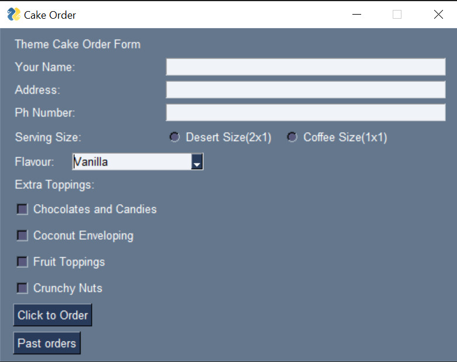
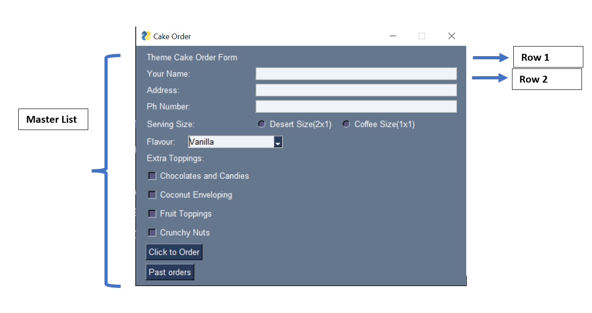
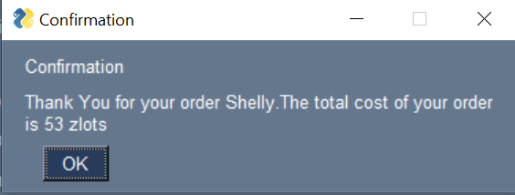

<link rel ="stylesheet" href="style2.css">
  <div class = "heading">
    <h1>'PySimpleGUI' is magical</h1>
  </div>
  <nav class = "topbar">
    <button onclick="window.location.href='index.html';">About</button>
    <div class="dropdown">
      <button class = "dropbtn">Portfolio</button>
        <div class="dropdown-content">
          <a href="Python.html">Python</a>
          <a href="Javascript.html">Javascript</a>
        </div>
    </div>
    <button onclick="window.open('https://www.youtube.com/@shellysachdev/videos', '_blank')">YouTube</button>
  </nav>

  Python is a very powerful coding language and it has a number of useful packages which coders can use to create what they want.

  Recently, with my Year 12 students, I explored the magical 'PySimpleGUI' library which is simple yet a very powerful tool to build GUI apps in pure python. Later, we even used 'sqlite3' package in Python to let our app do the talking with a database. This tutorial will focus on the GUI part of the app that we built in our Computer Sciences classes. 
  
  
  We built a Cake Order form with various input boxes, radio buttons, dropdowns and checkboxes. Depending upon various choices that the user selects on the app, the app displays the total cost of their order and displays it. The idea was to let students have fun while coding. Eventually, below was our final front face of the app.

  <center></center>

## Step 1 - Install the 'PySimpleGUI' package. 


  Just like installing any other Python library, PySimpleGUI can be installed by a simple pip install command in the cmd terminal. Please note that the name of the library is case-sensitive.

  ```{cmd}
  pip install PySimpleGUI
  ```

## Step 2 - Let's start coding! Import PySimpleGUI into your code.


  Now that we have installed the required library, let us import it into our Python code. 

  ```{Python}
  import PySimpleGUI as sg
  ```
  
  You may be wondering what this 'sg' is all about. When I say import PySimpleGUI as sg, it just means that everytime I use the name of the library in my code, I want to avoid the hassle of writing 'PySimpleGUI' since it is a long name. Hence, I have nicknamed 'PySimpleGUI' as 'sg'.

## Step 3 - Creating a layout window


  As you saw in the final picture of the app, the final output is a window with a number of different widgets/elements. Let us now design the layout of our window. The layout of the window is defined as a Python list and inside the master list, we have several other lists. Each list inside the master list is one row inside the window. See the annotated diagram below to understand this better:

  <center></center>

  As you can see in the annotated picture above, inside the main master window, we have different elements placed in different rows. Row 1 has the label 'Theme Cake order Form', row 2 has the label 'Your Name' and an input box next to it and so on and so forth. The same structure described here can be employed in our coding style for the design of layout window. We will create one master list and then we will create several lists inside for each row and simply place elements in appropriate lists. Let us see how do we do that in Python:

  ```{Python}
layout = [
    
[sg.Text("Theme Cake Order Form")],
[sg.Text('Your Name: ',size=(20,1)),sg.InputText(key="-TEXT1-")],
[sg.Text('Address: ',size=(20,1)),sg.InputText(key="-TEXT2-")],
[sg.Text('Ph Number: ',size=(20,1)),sg.InputText(key="-TEXT3-")],
[sg.Text('Serving Size: ',size=(20,1)),
 sg.Radio('Desert Size(2x1)', "RADIO1",key='-RADIO1-'),
 sg.Radio('Coffee Size(1x1)', "RADIO1",key='-RADIO2-')],
[sg.Text("Flavour:  "),
 sg.Combo(['Mud Cake Chocolate','Mud Cake Caramel','Vanilla', 'Mud Cake Toblerone'],default_value='Vanilla',key='-flavour-')],
[sg.Text("Extra Toppings: ")],
[sg.Checkbox('Chocolates and Candies', key = '-CHOCO-')],
[sg.Checkbox('Coconut Enveloping', key = '-COCO-')],
[sg.Checkbox('Fruit Toppings', key = '-FRUIT-')],
[sg.Checkbox('Crunchy Nuts', key = '-NUTS-')],
[sg.Button('Click to Order', key = '-BUTTON-')],
[sg.Button('Past orders', key = '-BUTTON2-')]

]
```
As you can clearly see above, we have out master list called 'layout' and inside it we have several lists separated by a comma. Each list separated by a comma is one row. 

There are several attributes that we have used with each element above. Let us take an example of the below line of code:

```{Python}
[sg.Text('Your Name: ',size=(20,1)),sg.InputText(key="-TEXT1-")]
```

In the above line of code, we have the first element as 'Text' which will be visible as 'Your Name: ' on the front end, then we have the size as (20,1) which means this text element will have a width of 20 pixels and height of 1 pixel. 
In this row, we also have an Input Box where the user will enter their name. This Input Box has a key '-TEXT1-' as a parameter. We must understand here that we need a key for this element because we need to manipulate the value inside this input box later in our code and so we need a way to identify this value uniquely hence the concept of a key. A key is a unique name to identify a value in an element.  

You will notice that all the elements whose values need to be extracted or manipulated in our code at a later stage have a unique key. Keys do not need to start and end with a hyphen, nor do they need to be all uppercase letters, but this format has been mentioned in the Python documentation on PySimpleGUI hence I used the same format. You can name the 'keys' the way you like. 

## Step 4 - Let us create our window


We have successfully designed the layout of our window but are we ready to hit the 'Run' button to see the window ? Not yet. We need to initialize a variable which is an instance of the 'Window' method of PySimpleGUI package and it takes two parameters: 

1. **Title** - This will be the title of the window. Notice the 'Cake Order' title in the annotated picture above. 
2. **Layout** - The layout that we designed above is the second parameter. 

```{Python}
window = sg.Window('Cake Order',layout)
```

Are we now ready to hit the 'Run' button? No, still not. Let us execute the next step and then we will Run the code to see if we have the window ready.

## Step 5 - Let us define some events.


Before we run our code, we want to make sure that our window will be able to make sense of the events that happen in the window. Also, we want to be sure that the window will remain open on our screen unless and until we close it explicitly and hence the code below:

```{Python}
while True:
    event, values = window.read()
    if event == sg.WIN_CLOSED:
        break
window.close()
```

## Step 6 - Calculate the price of order 


Our final app should be able to display the total price of the cake depending upon the options chosen by the user. Let us initialize a variable 'price' which has an intital value of 0 and let us use the variable 'name' which will store the user's name. 

```{Python}
while True:
    price = 0 #Initial price is 0
    event, values = window.read()
    name = values['-TEXT1-'] #The value entered by the user in the name field will be placed in the variable 'name'
    if event == sg.WIN_CLOSED:
        break
window.close()
```

The next thing that we need to do is to see what serving size was selected by the user. Depending on the serving size selected, the price variable will be updated.

The most important thing is that the value in the 'Serving Size' radio button will be read only when the user clicks on 'Click to Order' button. The click of a button is an event triggered by the button with key '-BUTTON-' which needs to be read by our window. 

```{Python}
while True:
    price = 0
    event, values = window.read()
    name = values['-TEXT1-']
    if event == sg.WIN_CLOSED:
        break
    if event == '-BUTTON-':
        if values['-RADIO1-']== True:
            price = price + 30
        else:
            price = price + 20
window.close()
```

Next lines in our code inside the while True loop are simply checking what values were selected in the 'flavor' dropdown and 'extra toppings' checkboxes. The variable 'price' will be updated inside the multiple 'if' statements depending upon which conditions are True.

```{Python}
    #Checking what flavor was selected by the user
    flavor = values['-flavour-']
    if flavor == 'Mud Cake Chocolate':
      price = price + 10
    elif flavor == 'Mud Cake Caramel':
      price = price + 12
    elif flavor == 'Mud Cake Toblerone':
      price = price + 15
    else:
      price = price + 10

    #Checking what all extra toppings did the user select
    if values['-CHOCO-'] == True:
      price = price + 5
    if values['-COCO-'] == True:
      price = price + 6
    if values['-FRUIT-'] == True:
      price = price + 7
    if values['-NUTS-'] == True:
      price = price + 8
```
Last but the most important part is to display the total price of the order as a popup window at the end. 

```{Python}
output = f'Thank You for your order {name}.The total cost of your order is {price} zlots'
sg.Popup('Confirmation',output)
```

The popup window looks like:
<center></center>


